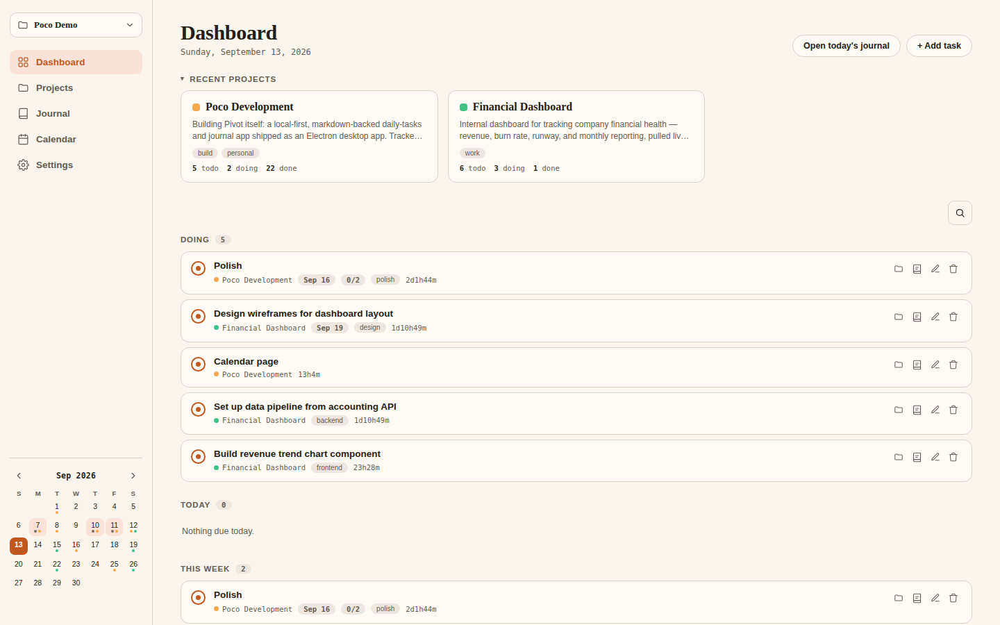
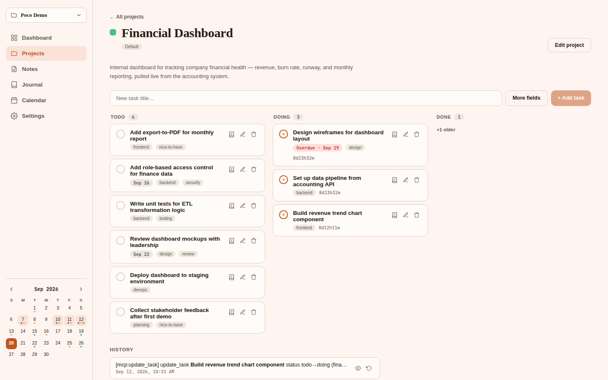
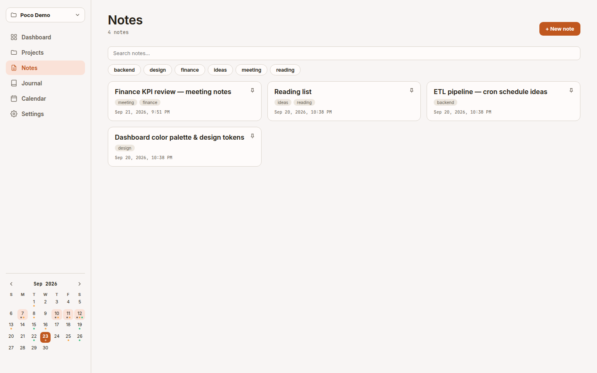
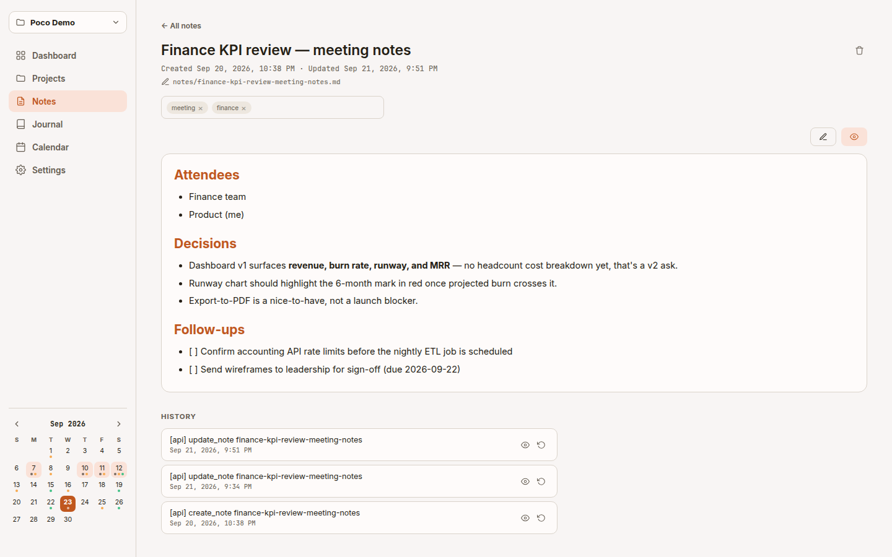
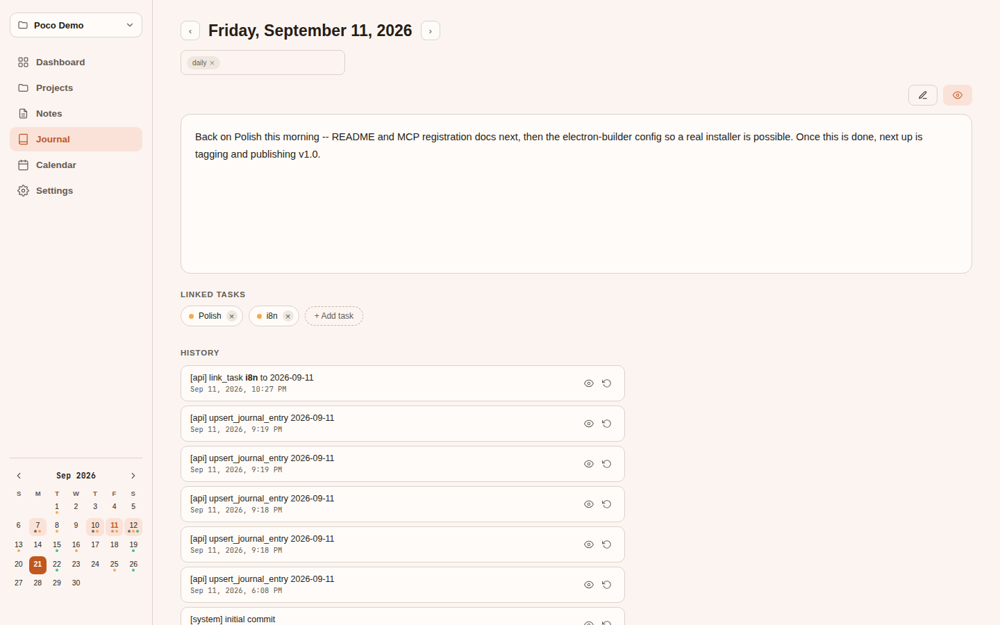
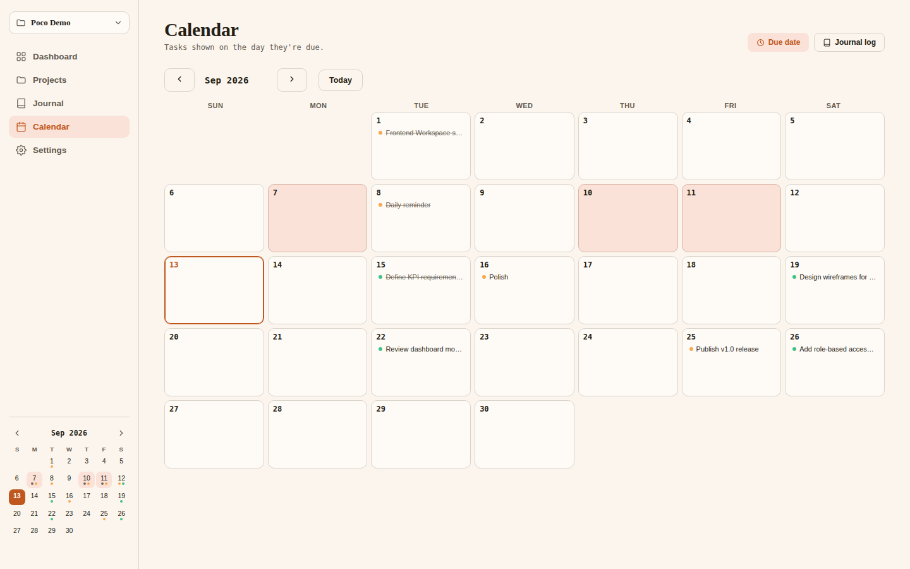

# poco

A personal, local-first daily-tasks + journal app backed entirely by plain
markdown files — tasks grouped by project, journal/daily notes bucketed by
year. No hosted backend, no accounts, no lock-in: your vault is just a folder
of `.md` files you can read, edit, `grep`, sync, or back up with any tool you
already use.

Ships as an **Electron desktop app**, with AI-agent access (Claude Code,
Claude Desktop, or any other MCP client) via a built-in **MCP server**,
git-backed versioning as an undo mechanism for any edit — human or agent —
and optional git-remote sync.

## Screenshots

| Dashboard                                    | Project (Kanban)                                             |
| -------------------------------------------- | ------------------------------------------------------------ |
|  |  |

| Notes                                                             | Note (rendered preview)                                               |
| ----------------------------------------------------------------- | --------------------------------------------------------------------- |
|  |  |

| Journal entry                                                                    | Calendar                                             |
| -------------------------------------------------------------------------------- | ---------------------------------------------------- |
|  |  |

## Name

**poco** — "a little," in Spanish/Italian/Portuguese — is what this app actually is under the hood: a lot of small, self-contained pieces rather than one big system. A task is one line in a plain file. A day is one small journal entry. A project is just another file, not a row locked inside a database. There's no server to run, no account to create, no monolith to back up — just small, modular, markdown micro-entries, added a little at a time.

## Why

Existing markdown-based tools (Obsidian, Logseq, Dendron, org-mode/org-journal,
Foam, SilverBullet) all get close, but none match "one task file per project,
one journal file per day, grouped by year" without heavy plugin configuration
or accepting a different file-per-unit convention. `poco` is built around
that exact layout from the ground up.

## Features

- **Markdown is the source of truth.** Every task and journal entry is a plain
  `.md` file on your disk. A `node:sqlite` index is a derived, always-rebuildable
  cache — never a place data lives that isn't also in the files. Delete it,
  reopen the app, get identical results.
- **Rich tasks**: description, creation time, tags, due date, sub-tasks
  (checklists), and automatic time-tracking — move a task to "doing" and the
  clock starts, no manual timer. Drag-and-drop between Todo/Doing/Done
  columns.
- **Projects** carry a description, tags, and a color (from a preset palette
  or any custom hex) shown as calendar marks and badges, and can be grouped
  (e.g. "Work" / "Personal") for filtering on the Dashboard.
- **Journal entries** can link to the tasks you worked on that day, with a
  searchable task picker, and have the same Edit/Preview toggle as notes.
- **Notes**: a lightweight third content type alongside tasks and journal
  entries — just markdown files with a title, tags, and created/updated
  timestamps (`<workspace>/notes/<slug>.md`), with an Edit/Preview toggle for
  rendered markdown and the same git history/undo as everything else.
- **File attachments**: attach images and files to tasks, journal entries,
  and notes (inserted as a plain markdown link/image, rendered inline in
  Preview mode), plus a profile image per project.
- **Dashboard**: today/overdue/this-week task buckets across all projects,
  recent projects, quick-add, and a cross-type search popup (Ctrl/Cmd+K).
- **Search**: one search across task titles/descriptions, journal bodies,
  note bodies, and project names/descriptions, with tag and date-range
  narrowing.
- **Calendar**: a compact sidebar month grid (marks due dates and journal
  entries, click-through to any day) plus a full-page Calendar view listing
  task titles per day, with a due/journal toggle and a year overview for
  fast month-picking.
- **Theming**: light/dark theme and a choice of accent-color palettes
  (Default, Green, Blue, Violet), switchable instantly in Settings.
- **Keyboard shortcuts**: app-wide shortcuts (quick search, quick add) plus
  find/replace inside the journal and note editors.
- **Multiple workspaces**, Obsidian-style — point the app at any folder via
  a native folder picker, switch between registered workspaces anytime.
- **Git-backed history**: every workspace is its own git repo, auto-committed
  on every write, tagged by origin (`[api]` vs `[mcp:<tool>]`) — any unwanted
  change (yours or an AI agent's) is a one-click revert away, with a diff
  view. Optional push/pull to a remote for backup/sync, with structured
  conflict surfacing.
- **MCP server** for agent access — 20 read/write tools over the same
  service layer the app itself uses (projects, tasks, journal entries and
  links, notes, and a cross-type `search_everything`), so any MCP-capable
  agent (Claude Code, Claude Desktop, etc.) can manage and summarize your
  tasks, journal, and notes directly. Targets an explicit workspace via
  `POCO_WORKSPACE`, independent of whatever workspace the app itself has
  open.
- **Daily reminder**: a native OS notification if you haven't journaled yet
  today, from a tray-resident background app (the app stays running in the
  tray after the window closes; only "Quit" actually quits). Launch-at-login
  and reminder time are configurable in Settings.

## Requirements

- [Node.js](https://nodejs.org/) **≥ 22.5** (for the built-in `node:sqlite`
  module — no native module to compile)
- [git](https://git-scm.com/) (each workspace is a git repo; the app shells
  out to your local git install)

Check your Node version:

```bash
node --version
```

## Getting started (development)

```bash
git clone <this-repo-url>
cd poco
npm install
```

This is an [npm workspaces](https://docs.npmjs.com/cli/v10/using-npm/workspaces)
monorepo (`server/`, `client/`, `electron/`) — one `npm install` at the root
installs everything.

### Run the app

```bash
npm run dev
```

Launches the Vite client and the Electron shell together (the Electron main
process embeds the Express server and points a `BrowserWindow` at it — the
renderer talks to `/api/...` over plain HTTP, same as a web app would).
First run prompts you to pick a workspace folder.

### Run the tests

```bash
npm test
```

Runs the server package's test suite (`node`'s built-in test runner via
`tsx`) — markdown round-trip parsing/serialization, services, MCP tools
(driven through a real `@modelcontextprotocol/sdk` client), workspace
registry, git-backed history/revert, sync, and more.

### Typecheck

```bash
npx tsc --noEmit -w server
npx tsc --noEmit -w client
npx tsc --noEmit -w electron
```

### Run the MCP server standalone

```bash
npm run mcp -w server
# or, targeting a specific workspace explicitly:
POCO_WORKSPACE=/path/to/workspace npx tsx server/src/mcp/index.ts
```

Exposes 20 tools (`create_project`, `create_task`, `update_task`,
`get_task_summary`, journal linking, notes CRUD, `search_everything`, etc.)
over stdio to any MCP host (Claude Code, Claude Desktop, ...). See
[PLAN.md](PLAN.md) for the full tool list and [PROGRESS.md](PROGRESS.md)'s
"Milestone 10 notes" for how workspace targeting works.

### Build a standalone desktop app

```bash
npm run package
```

Builds the server, the client, and the Electron shell, then runs
`electron-builder` to produce a standalone Linux `AppImage` in `release/`
(`release/Poco-<version>.AppImage`) — a single executable file, no install
step, no Node/npm required on the machine running it. Double-click it (or
`chmod +x` and run it from a terminal) like any other desktop app; it still
prompts for a workspace folder on first run, same as `npm run dev`.

Only a Linux target is configured today (`electron/electron-builder.yml`) —
Windows/macOS installers (platform-native icons, code signing) are tracked
as still outstanding under milestone 18 in [PROGRESS.md](PROGRESS.md). If
you need an unpacked build to poke at (no `.AppImage` bundling step), run
`npm run build -w electron && npx electron-builder --dir` from
[electron/](electron/) instead.

## Project structure

```
poco/
  server/     # Express + TypeScript backend, markdown core, SQLite index, MCP server
  client/     # Vite + React + TypeScript frontend (i18n: en/vi)
  electron/   # Electron desktop shell — main process, tray, daily reminder
  design/     # UI prototype (Claude Design canvas source)
  vault/      # a convenience default/dev workspace — not a hardcoded runtime path
```

## License

[GNU AGPLv3](LICENSE) — free to use, fork, modify, and even sell or host
commercially, with one condition: if you run a modified version and let
others interact with it over a network (e.g. as a hosted service), you must
offer them the corresponding source code. Closes the "SaaS loophole" that
plain GPL leaves open, so improvements — commercial or not — stay available
to everyone rather than disappearing into a closed-source fork.
