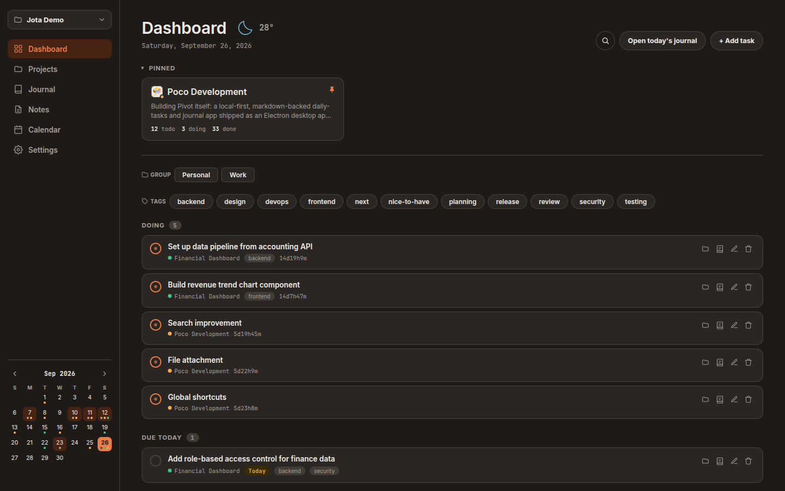

# Jota

**Journal + Tasks, in plain markdown**

A local-first desktop app for your daily tasks, journal, and notes.
Everything is saved as plain `.md` files in a folder you choose. There's no
account, no cloud backend, and no lock-in: you can read, edit, `grep`,
sync, or back up your vault with tools you already use.

Built in: kanban with automatic time tracking, a daily journaling reminder,
git-backed undo for every edit, optional git or WebDAV sync, and an MCP
server so AI agents like Claude can work with your tasks too.

**[⬇ Download the latest release](https://github.com/tdpi95/jota/releases/latest)**

## Screenshots

| Dashboard                                    | Project (Kanban)                                             |
| -------------------------------------------- | ------------------------------------------------------------ |
|  |  |

| Journal entry                                                                    | Calendar                                             |
| -------------------------------------------------------------------------------- | ---------------------------------------------------- |
|  |  |

| Notes                                                             | Dark theme                                                  |
| ----------------------------------------------------------------- | ----------------------------------------------------------- |
|  |  |

## Download

Grab the installer for your OS from the
[latest release](https://github.com/tdpi95/jota/releases/latest). No
Node.js or build step needed. On first launch, pick any folder to use as
your workspace (an empty one is fine).

Optional: install [git](https://git-scm.com/) to get per-edit undo history
and git-remote sync. Everything else, including WebDAV sync, works without
it.

## Why Jota

**One place for your day.** Open it, add a task or a line to today's
journal, close it — every day, for years. If today's entry is still blank,
a quiet reminder nudges you.

**Tasks without the ceremony.** No epics, no story points, no workflow to
configure: a checkbox, a due date, tags if you want them, and a "Doing"
column whose timer starts itself. Add it, work it, check it off.

**Files that outlive the app.** Everything is plain `.md` — `grep` it, edit
it in vim, sync it however you like, read it in ten years on software that
doesn't exist yet. The app is just a window onto a folder you own.

**Let an AI help, safely.** A built-in MCP server lets Claude Code, Claude
Desktop, or any MCP client add tasks, log entries, or summarize your week.
Every write is a git commit tagged with who made it, so an agent edit you
don't like is one click to undo.

## Jota vs Obsidian, Logseq, and friends

Obsidian, Logseq, Foam, SilverBullet, and org-mode are great general-purpose
knowledge tools — backlinks, graphs, outliners, plugin ecosystems. You _can_
turn one into a task tracker and daily journal, but you'll be choosing
plugins and templates before you've written anything down.

Jota goes the other way: tasks, a daily journal, and lightweight notes work
the moment you open it, with nothing to configure. Kanban, automatic time
tracking, an MCP server for AI agents, per-edit undo, and git or WebDAV sync
are built in, not assembled from plugins.

**Pick Jota if** you want a zero-setup daily driver for tasks and
journaling that an AI agent can safely read and write.

**Stick with Obsidian or Logseq if** you want a linked knowledge graph or a
deep plugin ecosystem. Your Jota workspace is still just markdown, so
nothing stops you from opening it in other tools too.

## Features

- **Markdown is the source of truth.** Every task and journal entry is a plain
  `.md` file on your disk. A `node:sqlite` index is a derived, always-rebuildable
  cache — never a place data lives that isn't also in the files. Delete it,
  reopen the app, get identical results.
- **Rich tasks**: description, creation time, tags, due date, sub-tasks
  (checklists), and automatic time-tracking — move a task to "doing" and the
  clock starts, no manual timer. Drag-and-drop between Todo/Doing/Done
  columns.
- **Projects** carry a description, tags, and a color (from a preset palette
  or any custom hex) shown as calendar marks and badges, and can be grouped
  (e.g. "Work" / "Personal") for filtering on the Dashboard.
- **Journal entries** can link to the tasks you worked on that day, with a
  searchable task picker, and have the same Edit/Preview toggle as notes.
- **Notes**: a lightweight third content type alongside tasks and journal
  entries — just markdown files with a title, tags, and created/updated
  timestamps (`<workspace>/notes/<slug>.md`), with an Edit/Preview toggle for
  rendered markdown and the same git history/undo as everything else.
- **File attachments**: attach images and files to tasks, journal entries,
  and notes (inserted as a plain markdown link/image, rendered inline in
  Preview mode), plus a profile image per project.
- **Dashboard**: today/overdue/this-week task buckets across all projects,
  recent projects, quick-add, and a cross-type search popup (Ctrl/Cmd+K).
- **Search**: one search across task titles/descriptions, journal bodies,
  note bodies, and project names/descriptions, with tag and date-range
  narrowing.
- **Calendar**: a compact sidebar month grid (marks due dates and journal
  entries, click-through to any day) plus a full-page Calendar view listing
  task titles per day, with a due/journal toggle and a year overview for
  fast month-picking.
- **Theming**: light/dark theme and a choice of accent-color palettes
  (Default, Green, Blue, Violet), switchable instantly in Settings.
- **Keyboard shortcuts**: app-wide shortcuts (quick search, quick add) plus
  find/replace inside the journal and note editors.
- **Multiple workspaces**, Obsidian-style — point the app at any folder via
  a native folder picker, switch between registered workspaces anytime.
- **Git-backed history**: every workspace is its own git repo, auto-committed
  on every write, tagged by origin (`[api]` vs `[mcp:<tool>]`) — any unwanted
  change (yours or an AI agent's) is a one-click revert away, with a diff
  view.
- **Remote sync**: push/pull to a git remote, or sync directly to a WebDAV
  server (Nextcloud, ownCloud, etc.) with no git remote needed — pick one
  provider per workspace in Settings. Both surface conflicts (a file changed
  on both sides since the last sync) rather than silently overwriting either
  side. WebDAV sync works even on a machine with no git installed at all —
  only local undo history and the git-remote option need it.
- **MCP server** for agent access — 20 read/write tools over the same
  service layer the app itself uses (projects, tasks, journal entries and
  links, notes, and a cross-type `search_everything`), so any MCP-capable
  agent (Claude Code, Claude Desktop, etc.) can manage and summarize your
  tasks, journal, and notes directly. Targets an explicit workspace via
  `JOTA_WORKSPACE`, independent of whatever workspace the app itself has
  open.
- **Daily reminder**: a native OS notification if you haven't journaled yet
  today, from a tray-resident background app (the app stays running in the
  tray after the window closes; only "Quit" actually quits). Launch-at-login
  and reminder time are configurable in Settings.

## Development requirements

- [Node.js](https://nodejs.org/) **≥ 22.5** (for the built-in `node:sqlite`
  module — no native module to compile)
- [git](https://git-scm.com/) — needed for the local undo/history feature and
  for git-remote sync (each workspace is a git repo; the app shells out to
  your local git install). Not required for WebDAV sync, which talks to the
  server directly over HTTP.

Check your Node version:

```bash
node --version
```

## Getting started (development)

```bash
git clone <this-repo-url>
cd jota
npm install
```

This is an [npm workspaces](https://docs.npmjs.com/cli/v10/using-npm/workspaces)
monorepo (`server/`, `client/`, `electron/`) — one `npm install` at the root
installs everything.

### Run the app

```bash
npm run dev
```

Launches the Vite client and the Electron shell together (the Electron main
process embeds the Express server and points a `BrowserWindow` at it — the
renderer talks to `/api/...` over plain HTTP, same as a web app would).
First run prompts you to pick a workspace folder.

> **Linux: `npm run dev` fails with a SUID sandbox error from a system
> terminal, but works from VS Code's integrated terminal?** On Ubuntu
> 23.10+/24.04 (`kernel.apparmor_restrict_unprivileged_userns=1`), Electron's
> sandbox needs the setuid-root helper `npm install` ships, but strips the
> permissions off of. VS Code's own AppArmor profile grants its process tree
> an exemption, which is why its integrated terminal is unaffected. Fix it
> (re-run after every `npm install`, which strips it again):
>
> ```bash
> sudo chown root:root node_modules/electron/dist/chrome-sandbox
> sudo chmod 4755 node_modules/electron/dist/chrome-sandbox
> ```

### Run the tests

```bash
npm test
```

Runs the server package's test suite (`node`'s built-in test runner via
`tsx`) — markdown round-trip parsing/serialization, services, MCP tools
(driven through a real `@modelcontextprotocol/sdk` client), workspace
registry, git-backed history/revert, sync, and more.

### Typecheck

```bash
npx tsc --noEmit -w server
npx tsc --noEmit -w client
npx tsc --noEmit -w electron
```

### Run the MCP server standalone

```bash
npm run mcp -w server
# or, targeting a specific workspace explicitly:
JOTA_WORKSPACE=/path/to/workspace npx tsx server/src/mcp/index.ts
```

Exposes 20 tools (`create_project`, `create_task`, `update_task`,
`get_task_summary`, journal linking, notes CRUD, `search_everything`, etc.)
over stdio to any MCP host (Claude Code, Claude Desktop, ...). See
[PLAN.md](PLAN.md) for the full tool list and [PROGRESS.md](PROGRESS.md)'s
"Milestone 10 notes" for how workspace targeting works.

### Build a standalone desktop app

```bash
npm run package
```

Builds the server, the client, and the Electron shell, then runs
`electron-builder` to produce a standalone Linux `AppImage` in `release/`
(`release/Jota-<version>.AppImage`) — a single executable file, no install
step, no Node/npm required on the machine running it. Double-click it (or
`chmod +x` and run it from a terminal) like any other desktop app; it still
prompts for a workspace folder on first run, same as `npm run dev`.

On Windows, `npm run package:win` produces an NSIS installer
(`release/*.exe`) instead. CI ([.github/workflows/build.yml](.github/workflows/build.yml))
builds both natively on their own runners and attaches them to a GitHub
Release on every `v*` tag. Targets are configured in
[electron/electron-builder.yml](electron/electron-builder.yml). If you need
an unpacked build to poke at (no bundling step), run
`npm run build -w electron && npx electron-builder --dir` from
[electron/](electron/) instead.

## Project structure

```
jota/
  server/     # Express + TypeScript backend, markdown core, SQLite index, MCP server
  client/     # Vite + React + TypeScript frontend (i18n: en/vi)
  electron/   # Electron desktop shell — main process, tray, daily reminder
```

## License

[GNU AGPLv3](LICENSE) — free to use, fork, modify, and even sell or host
commercially, with one condition: if you run a modified version and let
others interact with it over a network (e.g. as a hosted service), you must
offer them the corresponding source code. Closes the "SaaS loophole" that
plain GPL leaves open, so improvements — commercial or not — stay available
to everyone rather than disappearing into a closed-source fork.
